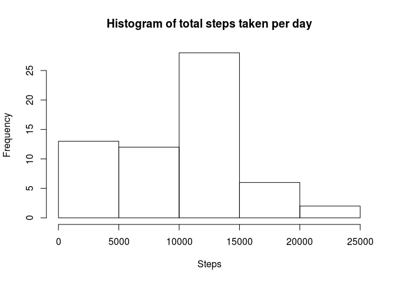
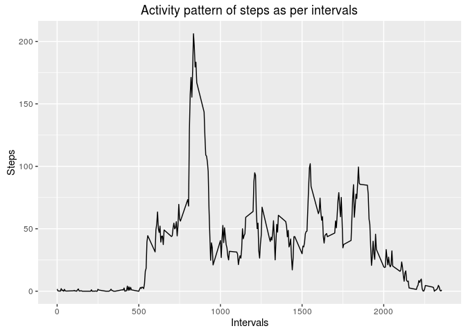
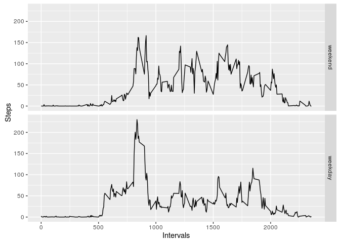

# Reproducible Research: Peer Assessment 1


## Loading and preprocessing the data

```r
unzip ("activity.zip", exdir = "./")
data <- read.csv("./activity.csv", header = TRUE)
```


## What is mean total number of steps taken per day?

```r
library(plyr)
MeanTotalSteps <- ddply(data, .(date), function(x) sum(x[, "steps"], na.rm = TRUE))
hist(MeanTotalSteps$V1, xlab = "Steps", ylab = "Frequency", main = "Histogram of total steps taken per day")
```

<!-- -->

```r
mean(MeanTotalSteps$V1)
```

```
## [1] 9354.23
```

```r
median(MeanTotalSteps$V1)
```

```
## [1] 10395
```

## What is the average daily activity pattern?

```r
ActivityPattern <- ddply(data, .(interval), function(x) mean(x[, "steps"], na.rm = TRUE))
library(ggplot2)
qplot(interval, V1, data = ActivityPattern, geom = "line", xlab = "Intervals", ylab = "Steps")
```

<!-- -->


## Imputing missing values

```r
MissingValuesLogicalVector <- is.na(data$steps)
NumberOfMissingValues <- length(which(MissingValuesLogicalVector))
NumberOfMissingValues
```

```
## [1] 2304
```

```r
dataNew <- data
dataNew$steps[which(MissingValuesLogicalVector)] <- 0
mean <- ActivityPattern[match(dataNew$interval, ActivityPattern$interval), "V1"]
dataNew$steps <- dataNew$steps + as.numeric(MissingValuesLogicalVector)*mean
```


## Are there differences in activity patterns between weekdays and weekends?

```r
dataNew$date <- as.Date(dataNew$date)
#create a vector of weekdays
weekdays <- c('Monday', 'Tuesday', 'Wednesday', 'Thursday', 'Friday')
#Use `%in%` and `weekdays` to create a logical vector
#convert to `factor` and specify the `levels/labels`
dataNew$wDay <- factor((weekdays(dataNew$date) %in% weekdays), 
         levels=c(FALSE, TRUE), labels=c('weekend', 'weekday'))
ActivityPattern <- ddply(dataNew, .(interval, wDay), function(x) mean(x[, "steps"], na.rm = TRUE))

qplot(interval, V1, data = ActivityPattern, geom = "line", xlab = "Intervals", ylab = "Steps", facets = wDay~.)
```

<!-- -->
